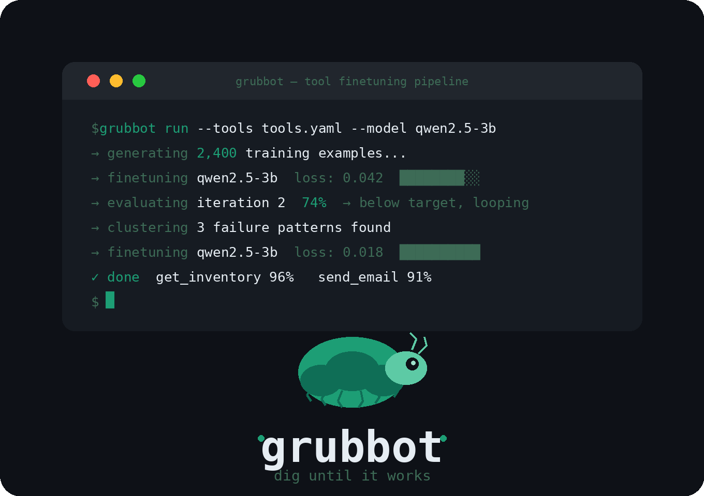



  

<h1 align="center">Grubbot</h1>

  <strong>Dig until it works.</strong> 
  <em>An autonomous pipeline that takes your custom tool definitions and produces a small, reliable, locally-finetuned model to use them flawlessly.</em>

  <a href="#the-problem">The Problem</a> •
  <a href="#how-it-works">How It Works</a> •
  <a href="#quick-start">Quick Start</a> •
  <a href="#the-four-stages">The 4 Stages</a> •
  <a href="#configuration">Configuration</a>

---
## 🛑 The Problem
Every developer who wants a local AI assistant hits the same wall: **small models (3B - 8B parameters) are inherently unreliable with custom tools out of the box.** They hallucinate parameters, call the wrong tools, or format responses incorrectly in JSON. 
Existing solutions (like traditional fine-tuning scripts) all share the same flaw: **they finetune once, evaluate once, and stop.** If the model fails on 20% of your tool calls, you have no automated path to fix it other than manually curating more data and starting over.
**Grubbot** is the solution. The name comes from the grub's instinct: dig through everything until you find what you need. That's the loop.
---
## ✨ Why Grubbot is Different
- **Starts from your tools, not benchmarks:** We don't use generic function-calling datasets. We parse *your* tools, defined however you want in a simple YAML file.
- **Autonomous Loop, not one-shot:** The pipeline tests the model, finds exact failures, fixes them, and retests. This is the pattern from automated AI research applied to tool-use fine-tuning.
- **Failure Clustering:** Grubbot doesn't just say *"78% accuracy"*. It groups failures by pattern using HDBSCAN on sentence embeddings and addresses the *why* (e.g. "Hallucinated optional parameter in get_weather").
- **Fully free after setup:** Uses a free cloud API once for initial data generator bootstrapping (Gemini 2.0 Flash / Groq). Everything after runs entirely locally on your hardware. Private. Fast. No recurring API costs.
---
## 🚀 Quick Start
### 1. Install Dependencies
``bash
# Clone the repository and install in editable mode
pip install -e .
``
### 2. Configure Environment
Copy the example environment variables and add your preferred provider credentials:
``bash
cp .env.example .env
``
*(Grubbot uses Gemini or Groq to synthesize the initial ChatML dataset)*
### 3. Run the Pipeline!
**If you don't have a GPU (Run Data Generation Only):**
``bash
grubbot datagen --tools examples/tools.yaml --goal examples/goal.md --provider gemini --count 50
``
**If you have an NVIDIA GPU (Run the Autonomous Loop!):**
``bash
grubbot run --tools examples/tools.yaml --goal examples/goal.md --model unsloth/qwen2.5-3b
``
---
## 🧬 The Four Stages in Depth
Grubbot operates in a linear but looping 4-stage pipeline. The loop between stages 2 ↔ 4 is the core innovation.
1. **🟡 Stage 1: Data Generation** 
   * **What it does:** Calls an LLM to synthesize hundreds of variations of queries based on your 	ools.yaml.
   * **The Output:** A perfectly formatted ChatML JSONL dataset featuring standard calls, edge-cases (missing optional params), and negative rejects.
2. **🟣 Stage 2: Finetuning** 
   * **What it does:** Uses Unsloth and TRL to rapidly train a **LoRA adapter** on your base HuggingFace model. Only ~1% of parameters are trained, ensuring blisteringly fast iteration speeds.
3. **🟠 Stage 3: Evaluation** 
   * **What it does:** Runs the newly-trained LoRA adapter against the held-out eval.jsonl test set. 
   * **The Output:** A hard-coded algorithmic score checking for *exact key matches*, *correct tool selection*, and *valid JSON parsing*.
4. **🔴 Stage 4: Failure Clustering & Auto-Loop** 
   * **What it does:** Extracts every single failed evaluation and embeds the bad outputs into a dense vector space using sentence-transformers. It runs density-based clustering (HDBSCAN) to find common patterns.
   * **The Fix:** It instructs the LLM provider to dynamically generate highly-targeted patch data specific to that exact failure cluster, appends it to your training set, and **loops back to Stage 2**.
---
## ⚙️ Configuration
Grubbot is intentionally config-driven. The entire pipeline is orchestrated by two files.
### 1. 	ools.yaml
Define your exact tools, descriptions, and structural parameters here.
``yaml
tools:
  - name: get_inventory
    description: Check stock levels for a product in a specific warehouse
    parameters:
      product_id:
        type: string
        description: The product identifier
        required: true
      warehouse:
        type: string
        description: Warehouse location code
        required: false
``
### 2. goal.md
Tell Grubbot what the success conditions look like for the loop to terminate.
``markdown
# Goal
Target: 95%+ accuracy on tool selection and parameter filling.
Priority: never hallucinate parameters.
Max iterations: 5
``
---
## 💻 The User Experience
When you fire up the autonomous loop, you'll actually get to see Grubbot continuously iterate until it hits your target:
``text
$ grubbot run --tools tools.yaml --model qwen2.5-3b
→ generating 240 training examples...
→ finetuning qwen2.5-3b  loss: 0.042 
→ evaluating iteration 1: 74% overall accuracy → below target, looping.
→ clustering 8 failures...
   ↳ Found Cluster: 'parameter hallucination'
   ↳ Generating 20 targeted patch examples for cluster...
→ finetuning qwen2.5-3b  loss: 0.018
→ evaluating iteration 2: 96% overall accuracy → Target Reached!
✓ done!
get_inventory: 98%
send_email: 94%
Model saved: ./models/grubbot-qwen2.5-3b-v2
``
---
## 👥 Who Is It For?
| User | Why Grubbot? |
|---|---|
| **Solo Developers** | Want a local AI that reliably uses their personal tools without hallucinating. |
| **Small Startups** | Can't justify / afford GPT-4 API overhead for production-scale tool use. |
| **Healthcare / Legal IT** | Strictly barred from sending sensitive data to cloud APIs. |
| **ML Engineers** | Want to own, audit, and control their entire model lifecycle locally. |
---

<i>built for developers who want models that actually listen.</i>

