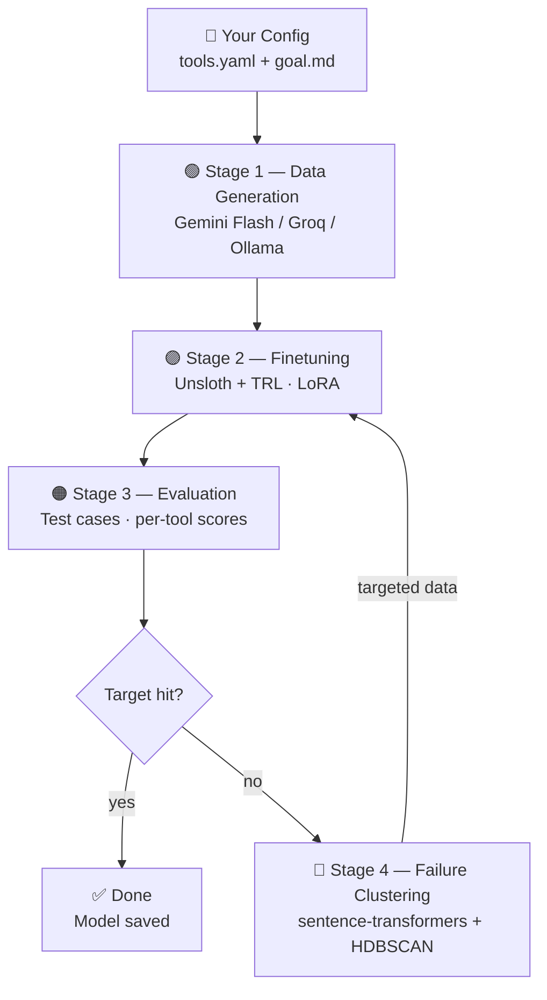

# Grubbot — Full Implementation Plan

> **Goal:** Build an autonomous, four-stage pipeline that takes user-defined tool descriptions and produces a small, reliable, locally-finetuned model for tool-use — iterating until a target accuracy is met.

---

## Architecture Overview

The SVG flowchart and spec describe a linear pipeline with a **retrain loop**:



The loop between Stages 2→3→4→2 is the **core innovation** — it runs autonomously until accuracy targets are hit or a max iteration count is reached.

---

## Tech Stack

| Layer | Tool | Role |
|---|---|---|
| **CLI / Entrypoint** | `click` + Python | `grubbot run`, `grubbot eval`, `grubbot loop` |
| **Config** | `PyYAML` + `pydantic` | Parse & validate `tools.yaml` and `goal.md` |
| **Data Generation** | `litellm` | Single interface to Gemini 2.0 Flash, Groq free tier, Ollama |
| **Finetuning** | `unsloth` + `trl` | LoRA adapter training on any HuggingFace model |
| **Evaluation** | Custom Python | Per-tool accuracy scoring on held-out `eval.jsonl` |
| **Failure Clustering** | `sentence-transformers` + `hdbscan` | Embed failed outputs, cluster by pattern, generate targeted data |
| **Models** | Any HF model | Qwen2.5, Llama3, Mistral, Phi, etc. |
| **Environment** | `python-dotenv` | Load API keys from `.env` |
| **Logging** | `loguru` | Structured run logs → `runs/` |

---

## Project Structure — File-by-File Plan

```
📁 GRUB-BOT/                          ← repo root
├── grubbot.py                         ← CLI entrypoint
├── pyproject.toml                     ← dependencies & project metadata
├── .env.example                       ← template for API keys
├── .gitignore                         ← ignore data/, models/, runs/, .env
├── README.md                          ← project documentation
│
├── 📁 grubbot/                        ← core Python package
│   ├── __init__.py
│   ├── config.py                      ← load + validate tools.yaml & goal.md
│   ├── pipeline.py                    ← orchestrate all 4 stages + own the loop
│   ├── datagen.py                     ← Stage 1: call LLM, output train.jsonl
│   ├── finetune.py                    ← Stage 2: Unsloth + TRL LoRA training
│   ├── eval.py                        ← Stage 3: run test set, score per tool
│   ├── cluster.py                     ← Stage 4: embed failures, HDBSCAN, label
│   └── loop.py                        ← Stage 4b: autonomous retrain controller
│
├── 📁 grubbot/providers/              ← LLM backend adapters
│   ├── __init__.py
│   ├── base.py                        ← abstract provider interface
│   ├── gemini.py                      ← Gemini 2.0 Flash (default)
│   ├── groq.py                        ← Llama 3.3 70B via Groq free tier
│   └── ollama.py                      ← any local model via Ollama
│
├── 📁 data/                           ← runtime-generated, gitignored
│   ├── train.jsonl
│   ├── eval.jsonl
│   └── 📁 failures/                   ← per-iteration failure dumps
│
├── 📁 models/                         ← saved LoRA checkpoints, gitignored
├── 📁 runs/                           ← run_001.json, run_002.json, ...
├── 📁 examples/                       ← starter tools.yaml + goal.md
└── 📁 tests/                          ← unit tests
    ├── test_config.py
    ├── test_datagen.py
    ├── test_eval.py
    └── test_cluster.py
```

---

## Proposed Changes — Detailed Per-File

### Component 1: Project Scaffolding

#### [NEW] [pyproject.toml](file:///c:/Users/Kundan%20kumar/Desktop/g/GRUB-BOT/pyproject.toml)
- Project metadata (`name = "grubbot"`, `version = "0.1.0"`)
- All dependencies: `litellm`, `unsloth`, `trl`, `transformers`, `peft`, `datasets`, `sentence-transformers`, `hdbscan`, `pyyaml`, `pydantic`, `click`, `python-dotenv`, `loguru`, `torch`
- CLI script entry: `grubbot = "grubbot:cli"` via `grubbot.py`

#### [NEW] [.env.example](file:///c:/Users/Kundan%20kumar/Desktop/g/GRUB-BOT/.env.example)
```env
GEMINI_API_KEY=
GROQ_API_KEY=
HF_TOKEN=
```

#### [NEW] [.gitignore](file:///c:/Users/Kundan%20kumar/Desktop/g/GRUB-BOT/.gitignore)
- `data/`, `models/`, `runs/`, `.env`, `__pycache__/`, `*.egg-info`

#### [NEW] [README.md](file:///c:/Users/Kundan%20kumar/Desktop/g/GRUB-BOT/README.md)
- Quick overview, installation, usage, architecture diagram reference

---

### Component 2: CLI Entrypoint

#### [NEW] [grubbot.py](file:///c:/Users/Kundan%20kumar/Desktop/g/GRUB-BOT/grubbot.py)
- Uses `click` to define three commands:
  - `grubbot run --tools <path> --goal <path> --model <model_name>` — full pipeline (all 4 stages + loop)
  - `grubbot eval --model <path> --data <path>` — run evaluation only
  - `grubbot loop --tools <path> --goal <path> --model <path>` — resume the retrain loop from a checkpoint
- Loads `.env` via `python-dotenv`
- Delegates to `grubbot.pipeline`

---

### Component 3: Configuration

#### [NEW] [grubbot/config.py](file:///c:/Users/Kundan%20kumar/Desktop/g/GRUB-BOT/grubbot/config.py)
- **`ToolDefinition`** (Pydantic model): `name`, `description`, `parameters: dict[str, str]`
- **`GoalConfig`** (Pydantic model): `target_accuracy: float`, `max_iterations: int`, `priorities: list[str]`
- **`GrubbotConfig`** (Pydantic model): combines tools + goal + model name + provider choice
- `load_tools(path) → list[ToolDefinition]` — parse `tools.yaml`
- `load_goal(path) → GoalConfig` — parse `goal.md` (extract target accuracy, priorities as structured data)
- Validation: fail early if tools have no params, if target < 0.0 or > 1.0, etc.

---

### Component 4: LLM Providers

#### [NEW] [grubbot/providers/base.py](file:///c:/Users/Kundan%20kumar/Desktop/g/GRUB-BOT/grubbot/providers/base.py)
- Abstract class `BaseProvider` with method: `generate(prompt: str, system: str) → str`
- Provider selection factory: `get_provider(name: str) → BaseProvider`

#### [NEW] [grubbot/providers/gemini.py](file:///c:/Users/Kundan%20kumar/Desktop/g/GRUB-BOT/grubbot/providers/gemini.py)
- Uses `litellm.completion(model="gemini/gemini-2.0-flash", ...)` 
- Default provider. Reads `GEMINI_API_KEY` from env.

#### [NEW] [grubbot/providers/groq.py](file:///c:/Users/Kundan%20kumar/Desktop/g/GRUB-BOT/grubbot/providers/groq.py)
- Uses `litellm.completion(model="groq/llama-3.3-70b-versatile", ...)`
- Reads `GROQ_API_KEY` from env.

#### [NEW] [grubbot/providers/ollama.py](file:///c:/Users/Kundan%20kumar/Desktop/g/GRUB-BOT/grubbot/providers/ollama.py)
- Uses `litellm.completion(model="ollama/<model>", ...)`
- Fully local, no API key needed.

---

### Component 5: Stage 1 — Data Generation

#### [NEW] [grubbot/datagen.py](file:///c:/Users/Kundan%20kumar/Desktop/g/GRUB-BOT/grubbot/datagen.py)

**Core logic:**
1. Takes tool definitions + goal config
2. Builds a **system prompt** instructing the LLM to generate diverse tool-call training examples in ChatML / function-calling format
3. For each tool, generates N examples (configurable, default 50) covering:
   - Correct tool selection
   - Correct parameter filling
   - Edge cases (missing optional params, similar tool confusion)
   - Negative cases (user query that should NOT trigger this tool)
4. Splits output 80/20 into `data/train.jsonl` and `data/eval.jsonl`
5. Each JSONL line: `{"messages": [...], "tools": [...], "expected_tool_call": {...}}`

**Key functions:**
- `generate_examples(tools, goal, provider, count_per_tool) → list[dict]`
- `build_datagen_prompt(tool: ToolDefinition) → str`
- `split_and_save(examples, train_path, eval_path, split_ratio=0.8)`

---

### Component 6: Stage 2 — Finetuning

#### [NEW] [grubbot/finetune.py](file:///c:/Users/Kundan%20kumar/Desktop/g/GRUB-BOT/grubbot/finetune.py)

**Core logic:**
1. Loads the base model via Unsloth's `FastLanguageModel.from_pretrained()`
2. Applies LoRA with `peft_config` (rank=16, alpha=16, target modules: q_proj, k_proj, v_proj, o_proj)
3. Loads `data/train.jsonl` into a HuggingFace `Dataset`
4. Formats each example into the model's chat template
5. Trains with `SFTTrainer` from TRL (2-3 epochs, lr=2e-4, batch_size auto)
6. Saves LoRA adapter to `models/grubbot-<model>-v<iteration>/`

**Key functions:**
- `load_model(model_name: str) → tuple[model, tokenizer]`
- `prepare_dataset(train_path: str, tokenizer) → Dataset`
- `train(model, tokenizer, dataset, output_dir, config) → TrainingResult`
- `save_checkpoint(model, tokenizer, path)`

---

### Component 7: Stage 3 — Evaluation

#### [NEW] [grubbot/eval.py](file:///c:/Users/Kundan%20kumar/Desktop/g/GRUB-BOT/grubbot/eval.py)

**Core logic:**
1. Loads the finetuned model (base + LoRA adapter)
2. Loads `data/eval.jsonl`
3. For each eval example, runs inference and compares:
   - **Tool selection accuracy**: did it pick the right tool?
   - **Parameter accuracy**: did it fill parameters correctly (exact match + fuzzy)?
   - **Format accuracy**: is the output valid JSON / function call?
4. Scores per-tool and overall
5. Returns structured `EvalResult` with list of `FailedExample` for Stage 4

**Key functions:**
- `evaluate(model, tokenizer, eval_path, tools) → EvalResult`
- `score_single(prediction, expected) → SingleScore`
- `EvalResult`: overall_accuracy, per_tool_accuracy, failures: list[FailedExample]

---

### Component 8: Stage 4 — Failure Clustering

#### [NEW] [grubbot/cluster.py](file:///c:/Users/Kundan%20kumar/Desktop/g/GRUB-BOT/grubbot/cluster.py)

**Core logic:**
1. Takes the list of `FailedExample` from eval
2. Embeds each failure's (input, predicted_output, expected_output) using `sentence-transformers` (model: `all-MiniLM-L6-v2`)
3. Runs HDBSCAN clustering on the embeddings
4. Labels each cluster with a human-readable failure pattern name (e.g., "parameter hallucination", "wrong tool selected", "malformed JSON")
5. Saves failure dump to `data/failures/iter_<N>.json`

**Key functions:**
- `embed_failures(failures: list[FailedExample]) → np.ndarray`
- `cluster_failures(embeddings) → list[FailureCluster]`
- `label_cluster(cluster: FailureCluster, provider) → str` — uses LLM to auto-label
- `FailureCluster`: cluster_id, label, examples, size

---

### Component 9: Stage 4b — Autonomous Loop Controller

#### [NEW] [grubbot/loop.py](file:///c:/Users/Kundan%20kumar/Desktop/g/GRUB-BOT/grubbot/loop.py)

**Core logic:**
1. Takes failure clusters from Stage 4
2. For each cluster, generates **targeted** training examples that specifically address that failure pattern
3. Appends new examples to `data/train.jsonl` (augment, don't replace)
4. Triggers Stage 2 (retrain) → Stage 3 (re-eval) → Stage 4 (re-cluster)
5. Repeats until: `overall_accuracy >= target` OR `iteration >= max_iterations`
6. Logs every iteration to `runs/run_<N>.json`

**Key functions:**
- `generate_targeted_data(cluster: FailureCluster, tools, provider) → list[dict]`
- `run_loop(config: GrubbotConfig) → LoopResult`
- `LoopResult`: iterations, final_accuracy, per_tool_accuracy, clusters_resolved

---

### Component 10: Pipeline Orchestrator

#### [NEW] [grubbot/pipeline.py](file:///c:/Users/Kundan%20kumar/Desktop/g/GRUB-BOT/grubbot/pipeline.py)

**Wires everything together:**
1. Load config (tools + goal)
2. Run Stage 1 (datagen) → produces `train.jsonl` + `eval.jsonl`
3. Run Stage 2 (finetune) → produces model checkpoint
4. Run Stage 3 (eval) → produces `EvalResult`
5. Check: target hit? → Done. Save model, print report.
6. If not → Run Stage 4 (cluster) → Stage 4b (loop) → back to Step 3
7. Final: save best model, print summary, write run log

**Key functions:**
- `run_full_pipeline(config: GrubbotConfig) → PipelineResult`
- `run_eval_only(model_path, eval_path, tools) → EvalResult`

---

### Component 11: Example Configs

#### [NEW] [examples/tools.yaml](file:///c:/Users/Kundan%20kumar/Desktop/g/GRUB-BOT/examples/tools.yaml)
```yaml
tools:
  - name: get_inventory
    description: Check stock levels for a product in a specific warehouse
    parameters:
      product_id:
        type: string
        description: The product identifier
        required: true
      warehouse:
        type: string
        description: Warehouse location code
        required: true

  - name: send_email
    description: Send an email to a recipient
    parameters:
      to:
        type: string
        description: Recipient email address
        required: true
      subject:
        type: string
        description: Email subject line
        required: true
      body:
        type: string
        description: Email body content
        required: true
```

#### [NEW] [examples/goal.md](file:///c:/Users/Kundan%20kumar/Desktop/g/GRUB-BOT/examples/goal.md)
```markdown
# Goal
Target: 90%+ accuracy on tool selection and parameter filling.
Priority: never hallucinate parameters.
Max iterations: 5
```

---

### Component 12: Tests

#### [NEW] [tests/test_config.py](file:///c:/Users/Kundan%20kumar/Desktop/g/GRUB-BOT/tests/test_config.py)
- Test YAML parsing, validation, edge cases (empty tools, missing fields)

#### [NEW] [tests/test_datagen.py](file:///c:/Users/Kundan%20kumar/Desktop/g/GRUB-BOT/tests/test_datagen.py)
- Test prompt building, JSONL format, train/eval split ratios

#### [NEW] [tests/test_eval.py](file:///c:/Users/Kundan%20kumar/Desktop/g/GRUB-BOT/tests/test_eval.py)
- Test scoring logic (exact match, fuzzy match, per-tool aggregation)

#### [NEW] [tests/test_cluster.py](file:///c:/Users/Kundan%20kumar/Desktop/g/GRUB-BOT/tests/test_cluster.py)
- Test embedding, clustering, labeling with mock data

---

## Build Process — Phase-by-Phase

### Phase 1: Foundation (Week 1–2)
| Step | What | Deliverable |
|---|---|---|
| 1.1 | Create project scaffolding | `pyproject.toml`, `.env.example`, `.gitignore`, directory structure |
| 1.2 | Implement `config.py` | Tool + goal parsing and validation |
| 1.3 | Implement provider layer | `base.py`, `gemini.py`, `groq.py`, `ollama.py` |
| 1.4 | Write `test_config.py` | Passing config tests |

### Phase 2: Data Generation (Week 2–3)
| Step | What | Deliverable |
|---|---|---|
| 2.1 | Implement `datagen.py` | Prompt engineering for synthetic tool-call data |
| 2.2 | Test with Gemini Flash free tier | Working `train.jsonl` + `eval.jsonl` |
| 2.3 | Write `test_datagen.py` | Passing datagen tests |

### Phase 3: Finetuning (Week 3–5)
| Step | What | Deliverable |
|---|---|---|
| 3.1 | Implement `finetune.py` | Unsloth + TRL LoRA training wrapper |
| 3.2 | Test with Qwen2.5-3B on example data | Working LoRA adapter saved to `models/` |
| 3.3 | Implement `eval.py` | Per-tool accuracy scoring |
| 3.4 | Write `test_eval.py` | Passing eval tests |

### Phase 4: Failure Clustering + Loop (Week 5–8)
| Step | What | Deliverable |
|---|---|---|
| 4.1 | Implement `cluster.py` | HDBSCAN clustering on failure embeddings |
| 4.2 | Implement `loop.py` | Targeted data generation + retrain loop |
| 4.3 | Write `test_cluster.py` | Passing cluster tests |
| 4.4 | Implement `pipeline.py` | Full orchestration of all 4 stages |

### Phase 5: CLI + Polish (Week 8–10)
| Step | What | Deliverable |
|---|---|---|
| 5.1 | Implement `grubbot.py` CLI | `run`, `eval`, `loop` commands |
| 5.2 | Add run logging to `runs/` | JSON logs per iteration |
| 5.3 | Write `README.md` | Full documentation |
| 5.4 | End-to-end test | Complete pipeline run on example tools |

---

## Verification Plan

### Automated Tests
```bash
# Run all unit tests
python -m pytest tests/ -v

# Run individual test files
python -m pytest tests/test_config.py -v
python -m pytest tests/test_datagen.py -v
python -m pytest tests/test_eval.py -v
python -m pytest tests/test_cluster.py -v
```

### Manual Verification
1. **Config loading**: Run `grubbot run --tools examples/tools.yaml --goal examples/goal.md --model qwen2.5-3b` and verify it parses without errors
2. **Data generation**: Check that `data/train.jsonl` and `data/eval.jsonl` are created with valid ChatML-format entries
3. **Finetuning**: Verify a LoRA adapter checkpoint appears in `models/`
4. **Evaluation**: Verify per-tool accuracy scores are printed to console
5. **Full loop**: Run the complete pipeline and verify it either reaches the target accuracy or stops at max iterations, printing a summary report

> [!IMPORTANT]
> Finetuning (Stage 2) requires a CUDA-capable GPU with ≥8GB VRAM for 3B models. The user should confirm their GPU setup before we begin Phase 3.

---

## Key Design Decisions

1. **LiteLLM over raw SDKs** — Single interface means switching providers is one config change, not a code rewrite
2. **Pydantic for config** — Strong validation catches bad `tools.yaml` before any expensive training runs
3. **JSONL format** — Streaming-friendly, easy to append targeted data in the loop without rewriting files
4. **LoRA adapters** — Train only ~1% of parameters, keeps checkpoint sizes small (~50MB vs 6GB), fast to swap
5. **HDBSCAN over K-Means** — Density-based clustering doesn't require specifying K upfront, naturally handles noise/outliers in failure data
6. **Augment-and-retrain over replace** — Each loop iteration *adds* targeted examples to the training set rather than replacing, so the model doesn't forget previously learned patterns
